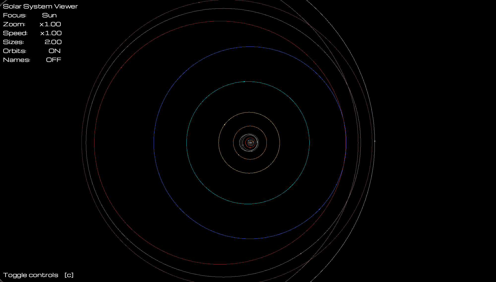
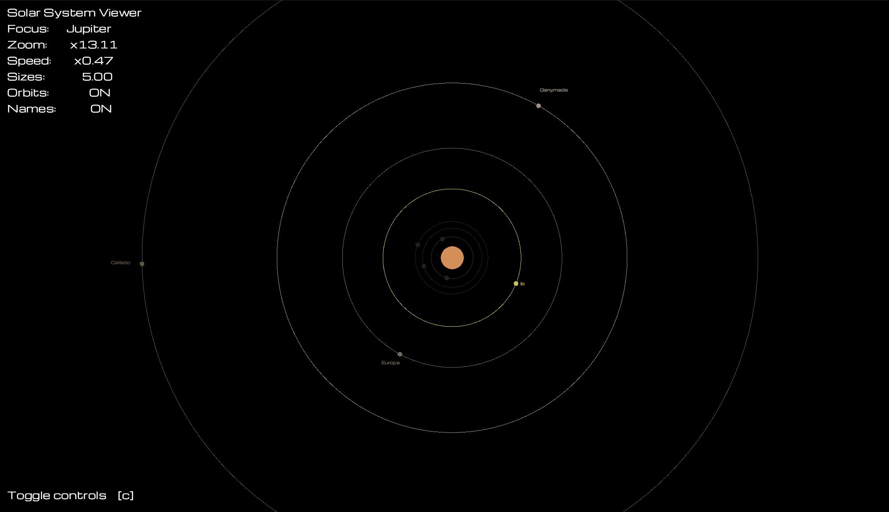
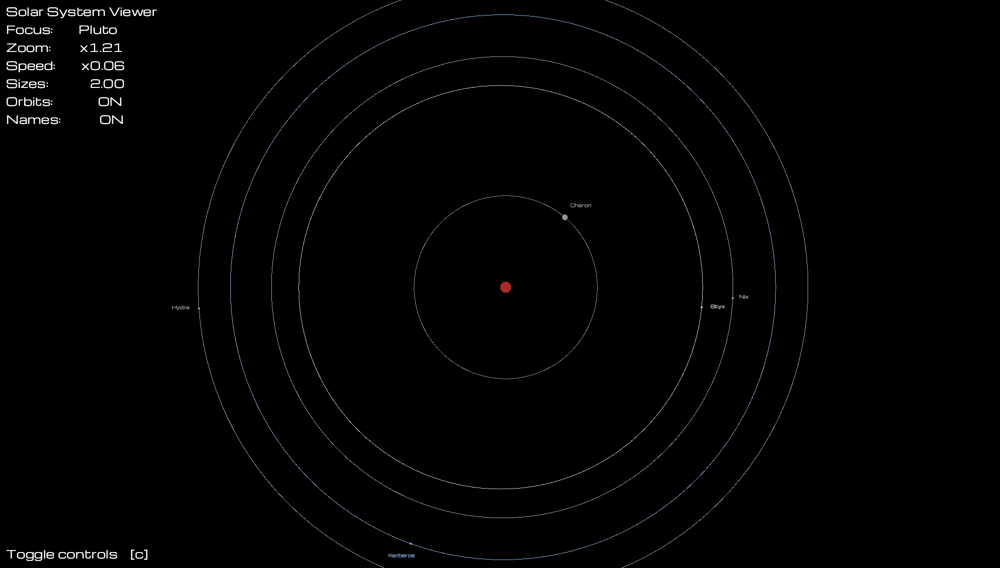

# Planet Simulation

[![Rust][rust-badge]][rust]
[![GitHub][github-badge]][repo]
[![Test Rust][rust-test-badge]][rust-test]
[![Coffee][buy-me-coffee]][coffee]
[![License: MIT][license-badge]][license]

2D Simulation of the Solar System

*Main view of the Solar System with default settings*

### Simulation

- Motion of planets and dwarf planets around the Sun
- Motion of satellites around each body in the previous simulation
- Orbital motion around a fixed elliptical path 

*Zoomed view of Jupiter showing the Galilean moons enlarged*

Limitations:
- 2D orbits all in the same plane
- Inclination ignored
- Periapsis at zero for all bodies
- Random starting angle for each body
- Fixed cutoff radius to ignore bodies
- Bodies have minimum radius so are always visible
- Planetary bodies fixed when they are the focus
  - Satellites orbit the centre of the main body
  - Major satellites around each object are highlighted
  - Minor satellites are dimmed
- Bodies are all represented by a single colour circle

*Pluto view showing some of the limitations of the simulation. Pluto is fixed and Charon orbits the centre of Pluto*

### Data

The simulation uses data on the averaged motion of the planets taken from [Johnston's Archive](https://www.johnstonsarchive.net/astro/index.html). For more information [see here](https://github.com/zwill22/planetsim/blob/main/data/README.md).

[//]: # (Links)
[rust]: https://www.rust-lang.org
[repo]: https://github.com/zwill22/planetsim
[rust-test]: https://github.com/zwill22/planetsim/actions/workflows/rust.yml
[coffee]: https://coff.ee/zmwill
[license]: https://github.com/zwill22/planetsim/blob/main/LICENSE

[//]: # (Badges)
[rust-badge]: https://img.shields.io/badge/Rust-%23000000.svg?e&logo=rust&logoColor=white
[github-badge]: https://img.shields.io/badge/GitHub-%23121011.svg?logo=github&logoColor=white
[rust-test-badge]: https://github.com/zwill22/planetsim/actions/workflows/rust.yml/badge.svg
[buy-me-coffee]: https://img.shields.io/badge/Buy_Me_A_Coffee-FFDD00?logo=buy-me-a-coffee&logoColor=black
[license-badge]: https://img.shields.io/github/license/zwill22/xmlgenerator
